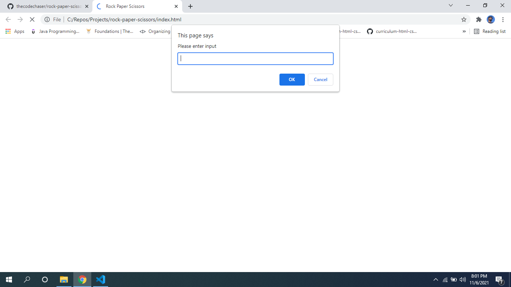

# Rock Paper Scissors

> Rock Paper Scissors project is a game project to play rock paper scissors with computer, play 5 times with computer then return result.

## Screenshots:

## Built With

- HTML
- CSS
- JavaScript

## Online live link

[Visit project online](https://thecodechaser.github.io/rock-paper-scissors/)

## Getting Started

To get a local copy up and running follow these simple example steps.

## Visit And Open Files

[Visit Repo](https://github.com/thecodechaser/rock-paper-scissors)

## Download Repo

[Download Repo](https://github.com/thecodechaser/rock-paper-scissors/archive/refs/heads/main.zip)

## Authors

👤 **Ranjeet Singh**

- GitHub: [@githubhandle](https://github.com/thecodechaser)
- Twitter: [@twitterhandle](https://twitter.com/thecodechaser)
- LinkedIn: [LinkedIn](https://linkedin.com/in/thecodechaser)

## 🤝 Contributing

Contributions, issues, and feature requests are welcome!

Feel free to check the [issues page](https://github.com/thecodechaser/rock-paper-scissors/issues).

## Show your support

Give a ⭐️ if you like this project!

## Acknowledgments

- Inspiration: Microverse

## 📝 License

This project is [MIT](./MIT.md) licensed.
